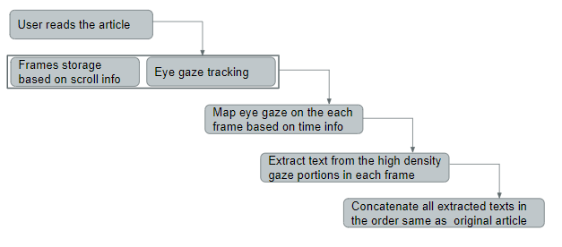

# Wikipedia-Analysis-through-Eye-Gaze
We develop a standalone platform-independent tool to automatically extract text from Wikipedia based on a reader's eye movement. 

# Languages Used
Python

C

# Flow Chart



## Installation for Mac OS X / Ubuntu / Windows systems

### Scripted Installation
* Install Opengazer: [https://github.com/qiffp/OpenGazer] for Mac OS X or Ubuntu systems
* Install Netgazer: [https://sourceforge.net/projects/netgazer/] for Windows systems
* Open a terminal and run:
** cd opengazer
** sudo bash dependencies.sh
** make

### Manual Installation 
python3-pip

* PyQt5
* MSS
* pynput
* OpenCv
* Numpy
* pytesseract
* Wnck
* Gtk
* Tensorflow

### apt-get

* tesseract-ocr

### Installing OCR tool

```bash
sudo apt-get install tesseract-ocr
```
## Config Files

* main_cofig
    1. [0] Determines when to start or stop capture_gaze script.
    1. [1] Determines when to store the captured gaze values into a variable.
    1. [2] Determines whether the program has been successfully calibrated or not.

* config
    1. [0] Determines when to start or stop the elg_demo script to calibrate the program.
    1. [1] Determines when to open the calibration window and run the subsequent script.
    1. [2] Determines when to run the Wait GUI and script.
    1. [3] Determines when to save the captured gaze values into a file.
    1. [4] Determines when to capture the gaze values and store it into a variable.

> The number within third bracket determines the index value of that line in the file.

# Application Run
cd Integration

python new_main.py

# Application Usage Procedure
Participants are required to follow the following steps during dataset collection:

<ol style="list-style-type:lower-roman">
  <li>Put the camera centrally under you monitor, so that the height of your face in the image is about half of the height of the image, and close to the centre of the image. Make sure the background light level is reasonably constant across the image.</li>
  <li>Start the application and click on the summarize button.</li>
  <li>The next default step is calibration. Remember, in order for this gaze tracker to work, you must keep your head absolutely still. Press "Calibrate". You will now be asked to look at various points on the screen, indicated by a target sign. Remember: do not move your head, only your eyes!</li>
  <li>When calibration is finished, you will be redirected to your default browser automatically. There you can start reading any Wikipedia article of your choice.</li>
  <li>Upon finishing the reading session, we will display the text that you focused while reading. Do the following as per your wish:</li>
    <ol style="list-style-type:lower-roman">
    <li>If you are satisfied with the text extraction, click on the Save button.</li>
    <li>If you don’t like the text extraction, click on the discard button.</li>
    </ol>
  <li>In the end, please rate the text extraction as per your satisfaction level.</li>  
</ol>
